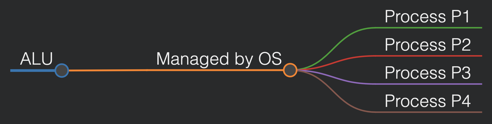
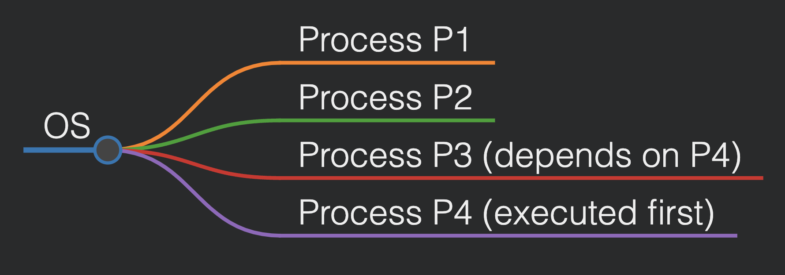
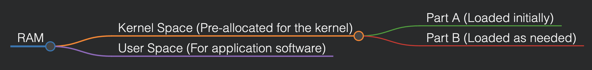
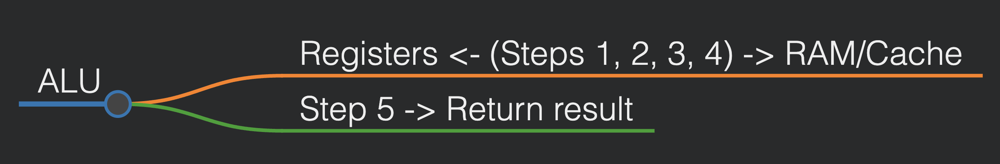

# Operating Systems Design (CSE323)

## Lecture 1 & 2 (Date: 18/01/25)

### Introduction to Operating System Design

#### OS Design Overview

Different tasks are often assigned to dedicated software. For example:
- **Chatting with friends/social media:** Use a web browser (e.g., Chrome).
- **Completing assignments:** Use a text editor (e.g., MS Word).

These types of software are **application-dependent**, meaning they are designed for specific tasks and are referred to as **application/user software.**

**Computer Hardware Components:**
- **CPU/Processor**
- **Memory/RAM**
- **I/O Devices** (Keyboard, Mouse, Printer, etc.)

The **Operating System (OS)** serves as an intermediary between application software and hardware, ensuring communication and resource management.

Key points:
- Users interact with application software, which in turn runs on hardware.
- The OS manages the execution of multiple software applications simultaneously.
- Users do not manually control resource allocation; the OS handles it.

The OS ensures that various processes such as memory management, security, and file management are handled efficiently. As software complexity increases, frequent OS updates are required.

A good OS is measured by how user-friendly and efficient it is.

This course will explore **core concepts of operating system software**, which differ from application software development.

---

### OS Concepts (Chapter 1)

A computer system can be divided into four major components:

1. **Hardware:**
   - Provides the basic computing resources (CPU, memory, I/O devices).
2. **Operating System:**
   - Manages hardware and serves as an intermediary for applications.
3. **Application Programs:**
   - Define how system resources are used (e.g., word processors, browsers).
4. **Users:**
   - People, machines, or other computers using the system.

#### Abstract Hierarchical View

---

### Goals of an Operating System

1. **User Convenience:**
   - Execute user programs efficiently.
   - Simplify problem-solving.
2. **System Utilization:**
   - Efficient use of hardware resources.

Example: Quad-core processors contain:

Due to hardware limitations, the OS optimally manages processing capabilities.

---

### OS as a Resource Allocator

The OS must:
- Manage all resources efficiently.
- Resolve conflicting requests fairly.

#### Example of Resource Allocation
| Software     | Process | Resource Needed |
|--------------|---------|-----------------|
| Chrome       | P1      | Keyboard         |
| PowerPoint   | P2      | Keyboard         |

If multiple processes require the same resource (e.g., ALU), the OS schedules access logically, not simultaneously.

---

### OS as a Control Program

The OS also prevents errors and improper usage by controlling process execution.

Example of process dependency:

---

### The Kernel

The **kernel** is the core of an OS and has full control over system operations.

#### Kernel Features:
- Loaded at startup (after the bootloader).
- Handles I/O requests and CPU instructions.
- Modular to optimize RAM usage.

#### Memory Allocation Overview

The **kernel space** and **user space** do not overlap, ensuring system stability and security.

---

### OS Boot Process

**Bootstrap Program (Bootloader):**
- Stored in ROM (BIOS/firmware).
- Initializes system components.
- Loads the OS kernel into memory.

#### Functions of Bootstrap Program
1. Load OS into memory.
2. Load essential drivers for peripherals.

---

### Computer System Operation

The OS handles the **Fetch-Execute Cycle**:

1. Instruction Fetch (IF)
2. Instruction Decode (ID)
3. Data Fetch (DF)
4. Instruction Execution (EX)
5. Return Result (RR)

#### Visualization of Data Flow

---

## Next Class: Computer System Architecture

---