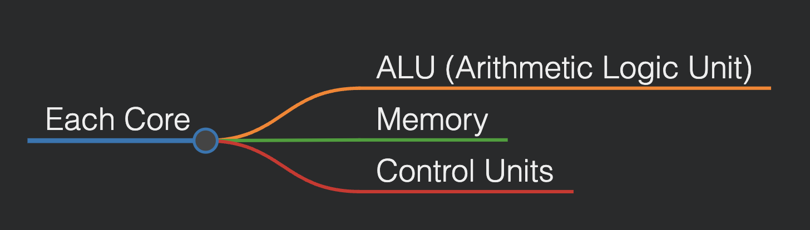

# Operating Systems Design (CSE323)

## Lecture 1 & 2 (Date: 18/01/25)

### Introduction to Operating System Design

#### OS Design Overview
Different tasks are typically handled by dedicated software. For example:
- **Chatting with friends/social media:** Use a web browser (e.g., Chrome).
- **Working on assignments:** Use a text editor (e.g., MS Word).

These software are **application-dependent** and are referred to as **application/user software.**

**Computer Hardware Components:**
- **CPU/Processor**
- **Memory/RAM**
- **I/O Devices**

The **Operating System (OS)** acts as an intermediate software layer between application software and hardware. It facilitates communication and resource management across various processes.

Key points:
- The OS is not used directly; instead, it manages application execution.
- Users do not manually allocate resources; the OS does it dynamically.
- OS manages processes, memory, security, file management, and more.

The efficiency and usability of an OS are the primary measures of its quality. Different OSs prioritize different aspects based on user needs.

This course will explore **core concepts of operating systems**, distinct from application software development.

---

### OS Concepts (Chapter 1)

A computer system can be divided into four major components:

1. **Hardware:**
   - Interacts with software and provides computing resources (CPU, memory, I/O devices).

2. **Operating System:**
   - Manages the hardware and acts as an intermediary between applications and hardware.

3. **Application Programs:**
   - Software such as word processors, browsers, etc.

4. **Users:**
   - The end-users of the system.


#### Abstract Hierarchical View


---

### Goals of an Operating System

1. **User Convenience:**
   - Execute user programs efficiently.
   - Simplify the problem-solving process.

2. **System Utilization:**
   - Ensure efficient use of hardware resources.

Example: Quad-core processors contain:



Due to limited hardware, smart OS management is essential to optimize performance.

---

### OS as a Resource Allocator

The OS must:
- Manage all resources efficiently.
- Resolve conflicting resource requests fairly.

#### Example of Resource Allocation
| Software     | Process | Resource Needed |
|--------------|---------|-----------------|
| Chrome       | P1      | Keyboard         |
| PowerPoint   | P2      | Keyboard         |

The OS ensures fair allocation based on user interactions.

---

### OS as a Control Program

The OS also prevents errors and improper usage by controlling process execution.

Example of process dependency:
```
OS -> P1
   -> P2
   -> P3 (depends on P4)
   -> P4 (runs first due to dependency)
```

---

### The Kernel

The **kernel** is the core of an OS and has full control over system operations.

#### Kernel Features:
- Loaded at startup (after the bootloader).
- Handles I/O requests and CPU instructions.
- Modular to optimize RAM usage.

#### Memory Allocation Overview

| RAM Allocation | Description               |
|----------------|---------------------------|
| Kernel Space   | Pre-allocated for kernel   |
| User Space     | Allocated for applications |

The **kernel space** and **user space** do not overlap, ensuring system stability.

---

### OS Boot Process

**Bootstrap Program (Bootloader):**
- Stored in ROM (BIOS/firmware).
- Initializes system components.
- Loads the OS kernel into memory.

#### Functions of Bootstrap Program
1. Load OS into memory.
2. Load essential drivers for peripherals.

---

### Computer System Operation

The OS handles the **Fetch-Execute Cycle**:

1. Instruction Fetch (IF)
2. Instruction Decode (ID)
3. Data Fetch (DF)
4. Instruction Execution (EX)
5. Return Result (RR)

#### Visualization of Data Flow
```
ALU
  ^
  |  (Step 5)
Registers <- (Steps 1, 2, 3, 4) -> RAM/Cache
```

---

## Next Class: Computer System Architecture

---