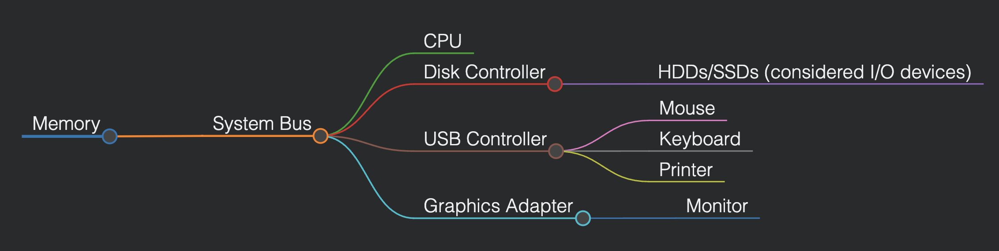
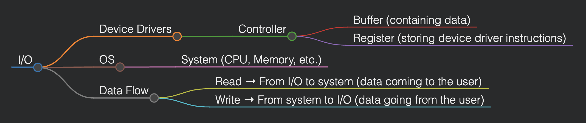
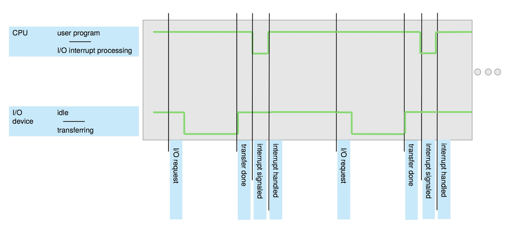

# Operating Systems Design (CSE323)

## Lecture 3 (Date: 23/01/25)

### Computer System Organization

A computer system is composed of:
- One or more **CPUs**.
- **Device controllers** connected via a **common bus**, providing access to shared memory.

This architecture allows concurrent execution of CPUs and devices competing for memory cycles.

#### Key Points:
- The **system bus** is on the motherboard.
- Connections with peripherals require a **common interface**, called controllers (e.g., USB, Bluetooth).
- Interfaces are **physical**, whereas **drivers** are software components needed for devices to function.

---

### High-Level View of I/O Operations

#### Explanation:
1. **Read Operation:**
   - Instructions are loaded from the device driver into controller registers.
   - Data from the buffer and register is read into the system through the OS.
2. **Write Operation:**
   - Data is written from the OS to the controller.
   - Instructions from the device driver are loaded into controller registers for writing to the I/O device.

---

### Role of Buffers and Microcontrollers

Since information flows back and forth via the system bus, **temporary storage** is required at the controller level, known as the **buffer.**

#### Controller Overview:

- Device drivers can run on the CPU, but since they operate at slower speeds, they are usually run on **microcontrollers.**
- Microcontrollers have lightweight processors and small memory to run limited processes efficiently.

---

### Phases of Data Transfer

#### Read Operation Phases:
1. Load instructions from the device driver into controller registers.
2. Read data from the buffer and register into the system via the OS.

#### Write Operation Phases:
1. Write data from OS to controller.
2. Load instructions from device driver into controller registers.
3. Write data to the I/O device from the buffer.

---

### Key Concepts Summary

1. **Concurrent Execution:** I/O devices and CPU operate concurrently.
2. **Device Controllers:** Each controller handles a specific device type.
3. **Local Buffers:** Each controller has its local buffer.
4. **Device Drivers:** OS uses drivers to manage controllers.
5. **Data Movement:**
    - CPU moves data between memory and local buffers.
    - I/O devices interact via their local buffer.
6. **Interrupts:** Device controllers notify the CPU upon operation completion via interrupts.

---

### Additional Notes

- **CPU Clock Speed:** If a CPU operates at 1GHz, it executes **10⁹ cycles per second**, meaning one instruction takes **1 nanosecond (10⁻⁹ seconds).**

---

### Interrupt Handling Timeline

---