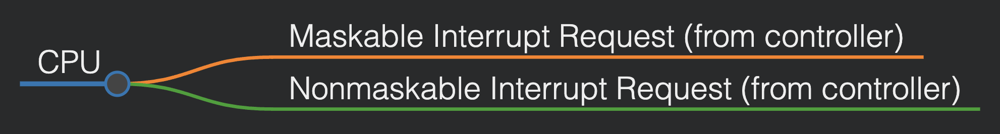

# OS Design (CSE323)

## Lecture on Interrupt Handling (25/01/25)

### Modern Interrupt Handling in Operating Systems

Modern operating systems require sophisticated interrupt handling features to ensure efficient and reliable performance. These features include:

1. **Deferred Interrupt Handling:**
   - The ability to defer interrupt processing during critical operations.

2. **Efficient Interrupt Dispatching:**
   - A mechanism to quickly and accurately dispatch the appropriate interrupt handler for a given software request.

3. **Multilevel Interrupts:**
   - The capability to distinguish between high and low priority interrupts, allowing the OS to respond with an appropriate degree of urgency.

In modern computer hardware, these capabilities are provided by the CPU and the interrupt controller hardware.

---

### Interrupt Lines in CPUs

Most CPUs have two primary interrupt lines:

1. **Non-Maskable Interrupt (NMI):**
   - Reserved for critical events such as unrecoverable memory errors.
   - Cannot be disabled by the CPU.

2. **Maskable Interrupt:**
   - Can be disabled or turned off by the CPU before executing critical instruction sequences.
   - Used by device controllers to request service from the CPU.

#### Visualization:

---

### Interrupt Request Handling

Interrupt requests (IRQs) are fed to the CPU through process lines. The standard Intel processor uses an event vector table with **256 vector numbers**, which can be represented using **8 lines**, since:

\[ 2^8 = 256 \]

These interrupt lines are often grouped together, typically in sets of 4, to organize and handle them efficiently.

---

### OS Operations and Interrupts

The operating system's operation begins with a series of crucial steps:

1. **Bootstrap Program:**
   - A simple code sequence responsible for initializing the system and loading the kernel.

2. **Kernel Loading:**
   - The kernel is loaded into memory to manage system resources.

3. **Starting System Daemons:**
   - Background services that run outside the kernel to support the OS functionality.

#### The Kernel and Interrupts

Once the system is initialized, the kernel is **interrupt-driven**, meaning it reacts to hardware and software interrupts.

1. **Hardware Interrupts:**
   - Triggered by hardware devices requesting attention (e.g., keyboard input, disk I/O completion).

2. **Software Interrupts (Execution or Traps):**
   - Generated during the execution of a process due to specific conditions:
     - **Software Errors:** Division by zero, illegal memory access.
     - **System Calls:** Requests made by processes for OS services.
     - **Processing Issues:** Infinite loops, inter-process interference, unauthorized modifications of OS components.

---

### Summary

Modern OS interrupt handling is designed to:
- Manage deferred processing efficiently.
- Quickly dispatch the correct handlers.
- Prioritize interrupts based on urgency.

The OS relies on both hardware (CPU and controllers) and software (interrupt-driven kernel) to manage system stability and responsiveness effectively.

---